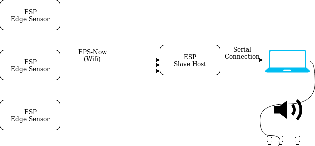

# Helsinki Lights

An interactive light and sound project based on the ESP32. This project will consist of three parts:

1. Edge Sensors
2. Slave Host
3. Light and Sound Client

# Component Description:

## Edge Sensors

These sensors will be resonsible for sensing when a metal object has been touched and relaying it via wifi
to the `slave host`.

The sensor will have 2 operating modes.

    MAIN Mode:
    The sensor will transmit via ESP-NOW a message that contains three parts
       Status (on/off), Pitch (note), Velocity (loudness)

    CONFIGURATION Mode:
    By long pressing (5 seconds) the button at boot the device will be put into
    configuration mode. It will turn the device into a captive portal
    where you can change the devices values.
    This means, they will be loaded from/saved to EEPROM,
    and will appear in the config portal.

## Slave Host

This component will be relaying the messages it recives to it's serial output. These messages will be MIDI style packets that
[spikenzielabs'](https://www.spikenzielabs.com/learn/serial_midi.html) can intercept to fake a MIDI device.

## Light and Sound Client

Accepts a MIDI connection to controll it and should drive the lights and speakers.
